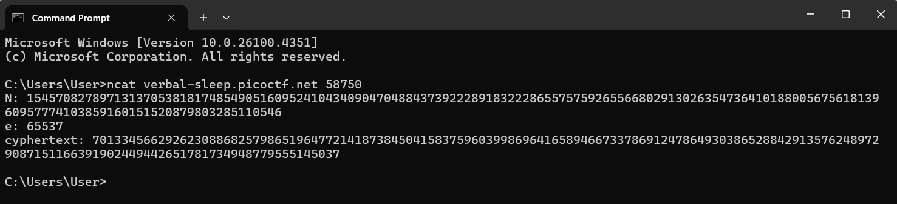

# [EVEN RSA CAN BE BROKEN??? - Easy](https://play.picoctf.org/practice/challenge/470?category=2&page=1)

## Challenge Description

This service provides you an encrypted flag. Can you decrypt it with just N & e?
Connect to the program with netcat:  

        $ ncat verbal-sleep.picoctf.net 58750
The program's source code can be downloaded [here](https://challenge-files.picoctf.net/c_verbal_sleep/eb8ebbb7306b0b21cc95fcd08fed7a6e3a0dd1323b8a0279c043d26349e911ff/encrypt.py).

## Challenge Overview

This challenge introduces us to RSA Encryption, which is a type of asymmetric encryption that utilizes a pair of private key and public key. It provides a netcat host connection and a source code that shows how the keys are generated.

## Provided Resources / Clues

**Source Code**
``` python
from sys import exit
from Crypto.Util.number import bytes_to_long, inverse
from setup import get_primes

e = 65537

def gen_key(k):
    """
    Generates RSA key with k bits
    """
    p,q = get_primes(k//2)
    N = p*q
    d = inverse(e, (p-1)*(q-1))

    return ((N,e), d)

def encrypt(pubkey, m):
    N,e = pubkey
    return pow(bytes_to_long(m.encode('utf-8')), e, N)

def main(flag):
    pubkey, _privkey = gen_key(1024)
    encrypted = encrypt(pubkey, flag) 
    return (pubkey[0], encrypted)

if __name__ == "__main__":
    flag = open('flag.txt', 'r').read()
    flag = flag.strip()
    N, cypher  = main(flag)
    print("N:", N)
    print("e:", e)
    print("cyphertext:", cypher)
    exit()
```

## Some Issues
1. In order to use [netcat](https://nmap.org/download.html) we have to install it ourselves
2. The source code was either not meant to be run by the user or a custom module `setup.py` is missing because of a function `get_primes` is not accessible
3. The crypto module is also another external module which would need to be installed using `pip install`
4. The provided command uses `nc`, which seems to be outdated, I changed it to `ncat` instead for it to work

## Assumptions

- I thought the netcat connection was required to be used in conjunction with the source code to obtain the correct key pair, but it turns out they both contribute to one function
- Since `setup.py` was missing I tried to generate a simple python script to replace it, but I had no way to make sure that my prime number generation would be the same as intended, so the idea was scraped.

## Solving Steps
1. Download and Install [NetCat](https://nmap.org/download.html)
2. **Launch Netcat** by using **Command Prompt** and connect to the host using the provided address 
3. You should get three values, the `N`, `E`, and `C` which stands for ciphertext.  
*(Note that each time you try the command it generates a different key pair since the prime number generation would be random, but every correct combination works)*  


       N: 15457082789713137053818174854905160952410434090470488437392228918322286557575926556680291302635473641018800567561813960957774103859160151520879803285110546 

       e: 65537  
        
       cyphertext: 7013345662926230886825798651964772141873845041583759603998696416589466733786912478649303865288429135762489729087151166391902449442651781734948779555145037


## Answer

    picoCTF{tw0_1$_pr!m33991588e}

## Resources Used

- [dCode RSA Decoder](https://www.dcode.fr/rsa-cipher) - To decrypt the message with the obtained key pair
- [Netcat](https://nmap.org/download.html) - To establish the connect channel to the host that generates the key pair

## Lessons Learnt
- RSA Cipher is an asymmetric decription which uses two distinct keys, or key pairs to encrypt and decrypt data

## Reflection

My knowledge on RSA encryption is on a beginner level, and I found a website that explains it in a simple way and I think it's worth a read. [Encryption Consulting](https://www.encryptionconsulting.com/education-center/what-is-rsa/)