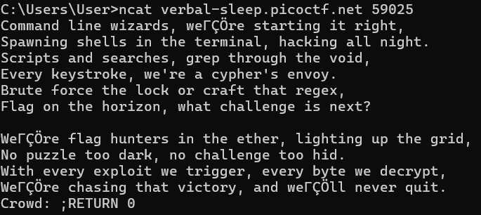

# [Flag Hunters - Easy](https://play.picoctf.org/practice/challenge/472?category=3&page=1)

## Challenge Description

Lyrics jump from verses to the refrain kind of like a subroutine call. There's a hidden refrain this program doesn't print by default. Can you get it to print it? There might be something in it for you.
The program's source code can be downloaded [here](https://challenge-files.picoctf.net/c_verbal_sleep/349dec0af4fab981e8b730f4895232ce55148d80d74c4d0e14d36e00c7674558/lyric-reader.py).  
Connect to the program with netcat:  

    $ nc verbal-sleep.picoctf.net 59025

## Challenge Overview

This is another challenge using netcat host connections and giving you the source code, to try and find a loophole and cheat the system into printing out the secret flag in the CLI

## Provided Resources / Clues

- The source code (too long)
- The description clearly states that there is something hidden within the refrains and we can focus on there


## Assumptions

- I tried to paste an incredibly long line of string to try and break the program by making it lose count of the rows somehow
- I tried using `\n` as the input to try and trick the system into printing a newline each time to exceed the max line count but it does not work

## Solving Steps
- Key function in the program
``` python
  # Print lyrics
  line_count = 0
  lip = start
  while not finished and line_count < MAX_LINES:
    line_count += 1
    for line in song_lines[lip].split(';'):
      if line == '' and song_lines[lip] != '':
        continue
      if line == 'REFRAIN':
        song_lines[refrain_return] = 'RETURN ' + str(lip + 1)
        lip = refrain
      elif re.match(r"CROWD.*", line):
        crowd = input('Crowd: ')
        song_lines[lip] = 'Crowd: ' + crowd
        lip += 1
      elif re.match(r"RETURN [0-9]+", line):
        lip = int(line.split()[1])
      elif line == 'END':
        finished = True
      else:
        print(line, flush=True)
        time.sleep(0.5)
        lip += 1
```

1.  Notice that the program uses `;` to split between lines, we can cheat the code by putting a `;` infront of our input to trick it into splitting our string
2. Notice that there is a **re.match** that is not used inside the original program, and it **specifies the lip to a int**, coincidentally **matching to the line with the secret flag**
3. Wait for the program to ask for your input and enter `;RETURN 0` 
4. The program should then print the secret intro and thus the flag is revealed!


## Answer

    picoCTF{70637h3r_f0r3v3r_a3d964ee}


## Lessons Learnt

- Reading other people's code is hard when there are no comments and you're not familiar with the libraries that they are using.
- Always document code properly, but in this case it might get you reverse engineered more easily ;d


